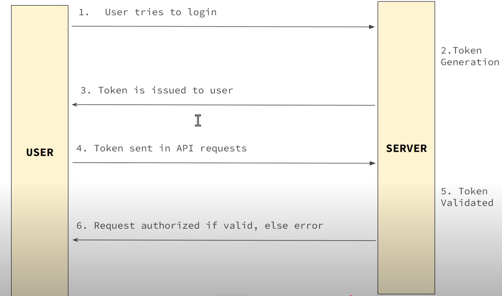

# jwt
JWT Demo

From https://www.youtube.com/watch?v=HzaXxmyq8k8&list=PLxhSr_SLdXGOpdX60nHze41CvExvBOn09&index=9
1:11:00

## Installation

Using https://github.com/jwtk/jjwt

add dependencies
```xml
<dependencies>
    <dependency>
        <groupId>io.jsonwebtoken</groupId>
        <artifactId>jjwt-api</artifactId>
        <version>0.12.6</version>
    </dependency>
    <dependency>
        <groupId>io.jsonwebtoken</groupId>
        <artifactId>jjwt-impl</artifactId>
        <version>0.12.6</version>
        <scope>runtime</scope>
    </dependency>
    <dependency>
        <groupId>io.jsonwebtoken</groupId>
        <artifactId>jjwt-jackson</artifactId> <!-- or jjwt-gson if Gson is preferred -->
        <version>0.12.6</version>
        <scope>runtime</scope>
    </dependency>
</dependencies>
```
## Database
```sql
create table users (
 username text,
 password text,
 enabled boolean);

create table authorities (
 username text,
 authority text);
```

## Intillij

See https://techblog.dac.digital/using-the-inbuilt-http-client-in-intellij-idea-8a362b84ba6b on howto use authentication

## Interaction
The pattern is



## Lombok
Define lombok processing see https://www.baeldung.com/lombok-ide
